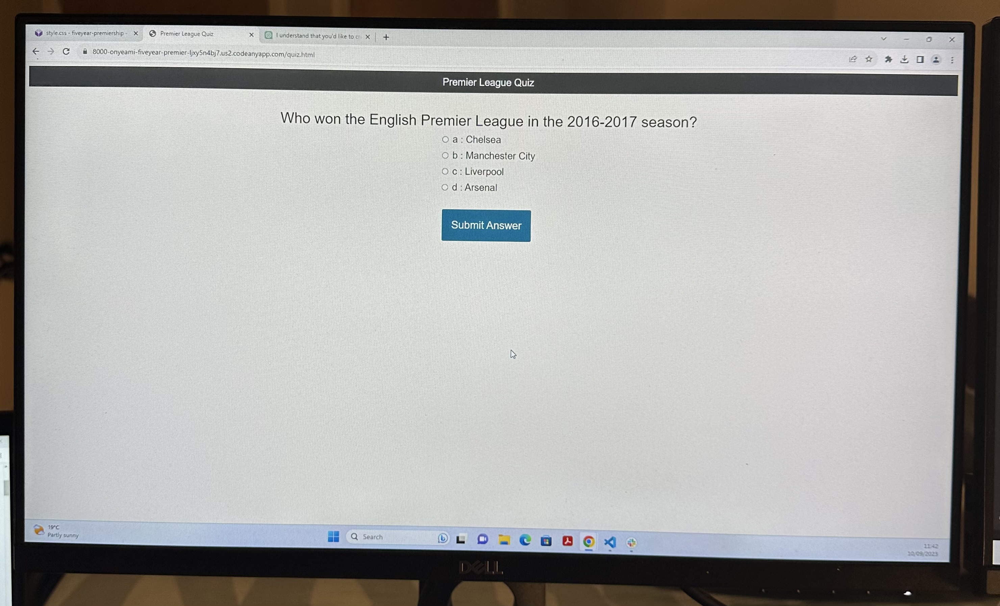

# **Last Five Year Premier League Quiz Game**

(Developer: Charles Onye)

[View the live project here](https://onyeami.github.io/premierfiveyears/)

Welcome to the Premier League Quiz Game. This is where you can test your knowledge of the English Premier League over the past five years. This README file provides an overview of the game's structure, objectives and user experience.

## Game Structure

1. ## _Quiz Questions_

   - The quiz consists of sixty multiple-choice questions related to the English Premier League from the last five years.
   - Each question has four options (a, b, c and d) to choose from.

2. ## _Objectives_

    - In as much as this is a football quiz website, it is designed for academic and leisure purposes, to stimulate the player's brain and test his football knowledge especially about the Premier League.
    - [First Time User Objectives](#first-time-user-objectives)
    - [Returning Player Objectives](#returning-players-goals)
    - [Frequent User Objectives](#frequent-user-objectives)

3. ## _Lives_

    - Each player starts with lives.
    - A player loses one life when he answers a question incorrectly.
    - The game ends when a player runs out of his three lives.
    - Each 1000 points attracts an extra live.

4. ## _User Authentication_

To play the game, users must log in with their email address. This ensures a personalized experience and allow us to track your progress and high scores.

## User Experience

The target audience comprises over one billion English Premier League fans from various parts of the world. Last five years landmark was chosen to ensure that the events remain fresh in the players' minds. This decision was made to enhance the quiz's user-friendliness, eliminating the need for players to ponder extensively over their answers.

## User stories

1. ## _First Time User Objectives_

   - First time user goal for visiting this Premier League quiz website is to test his knowledge of the Premier League. He will want to see how much he knows about the teams, players, history, and various aspects of the league.
  
   - First time user goal is to be entertained when taking the quiz. He may see it as a way to improve his trivia and knowledge retention skills. He will hope to gain insights into the league's history, famous moments, iconic players, and current events.
  
   - First time user may want to achieve competition, aiming to achieve a high score or top ranking on the quiz leaderboards.
   - First timer user might be seeking an engaging and interactive experience. He wants to interact with the website, answering questions and receiving feedbacks on his performance. He might be simply looking for a way to pass the time and relax while engaging with a subject he is passionate about.

2. ## _Returning Player's Goals_

    - A returning user would want to aim to improve his previous quiz scores. He will want to challenge himself and see if he can achieve a higher score or answer more questions correctly than before.

    - A returning user, becoming more familiar with the website, may start exploring additional features, such as specialized quizzes, historical data, or unique challenges, to keep their experience fresh.

    - A returning player may seek to become experts in Premier League trivia. He may want to deepen his knowledge and aim for near-perfect or 100% scores on quizzes.
  
    - a returning player's primary goal remains to have fun and enjoy his time on the website. He may see it as a relaxing way to unwind while indulging in his passion for football.

3. ## _Frequent User Objectives_

   - A frequent player will aim to achieve mastery in Premier League quiz game. He strives to consistently achieve hign score and demonstrate in-depth knowledge of the league.
  
   - A frequent player may see the website as a tool for continuous learning. He will want to deepen his understanding of the Premier League, including its history, tactics, and player profiles.

   - A frequent player will want to build and maintain connections with other players on the website. He may participate in discussions, join leagues or clubs, or engage in social features offered by the platform.

## Design

1. Colour Scheme
   - #f8f6f0 was used as the background colour

2. Typography
   - Arial font is the main font used throughtout the whole website with Sans-Serif as the fallback font.

3. Imagery
   - Screenshots of Premier League and some Premier League players were used as the quiz logo and the screen cover respectively. The logo is the official Premier League logo and the background image is action-packed images merged into one, of a thrilling moment from Premier League matches, such as goal celebration, teams line-ups.

4. Layout
   - The quiz has sixty questions and four multiple-choice options presented in a clean and organized format. Interactive elements, such as buttons are use to guide participants through the quiz.

## Wireframes

1. Laptop screen

2. Monitor screen

3. Phone screen

## Technologies Used

## Languages Used

- HTML
- CSS
- JavaScript

## Frameworks, Libraries and Programs Used

1. Bootstrap 4.4.1:
    - Bootstrap was used to assist with the responsiveness and styling of the website.
2. Hover.css:
    - Hover.css was used on the buttons while being hovered over.
3. Google Fonts:
    - Google fonts were used to import the 'Raleway' font into the style.css file which is used on all pages throughout the project.
4. Git
    - Git was used for version control by utilizing the Gitpod terminal to commit to Git and Push to GitHub.
5. GitHub:
    - GitHub is used to store the projects code after being pushed from Git.
6. Youtube:
   - Youtube was used for further researches and troubleshooting
7. Google Chrome:
   - Screenshots of Premier League logo and background image were taken from the google.

## Testing

- No errors were found using W3C CSS Validator
- No errors were found using Nu HTML checker
